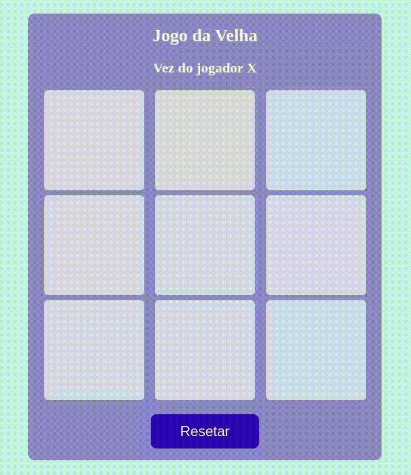

# About the project / *Sobre o projeto*

This project is the classic Tic Tac Toe Game, written in Javascript.

*Esse projeto é o clássico Jogo da Velha, escrito em Javascript.*

---
# Skills / *Habilidades*

 - Programming Logic / *Programming Logic*
 - Repeat Loops / *Laços de repetição*
 - Arrays
 - Functions / *Funções*
 - Dom and Selectors / *Dom e seletores*
 - Dynamic Elements / *Elementos de forma dinâmica*
 - Events / *Eventos*

---
# Layout

---
# Deployment / *Implantação*

See it in action/ **Veja em ação**: [https://kelsonbatista.github.io/tic-tac-toe-game/](https://kelsonbatista.github.io/tic-tac-toe-game/)
